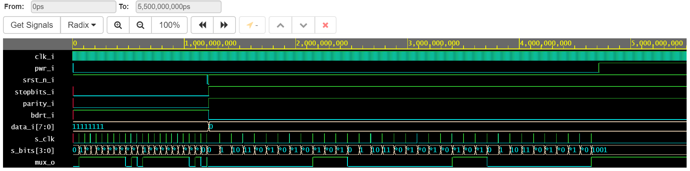
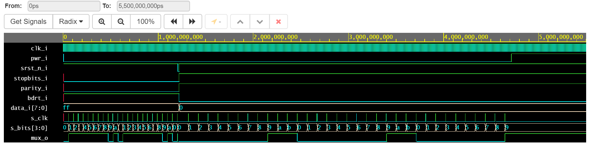

# Projekt - UART
  Universal asynchronous reciever-transmitter tedy univerzální asynchronní přijímač-vysílač. Slouží k sériové komunikaci s možností změny parametru. Signál vysílá po slovech začínajících start bitem a dále pokračujícími datovými bity s hlavní informací, paritním bitem a stop bitem. Start bit a stop bit slouží k určení délky slova pro přijímač. Paritní bit slouží ke kontrole stavu datových bitů. Datové bity jsou samotná informace, kterou chceme vysílat či přijímat.
  
&nbsp;  
   Za úkol jsme dostali pouze vysílač s možností nastavovaní parametrů vysílání.
Toto zpracování systému UART může volit mezi počet stop bitů, baud rate, paritu či být resetováno. Datových bitů je 8.
&nbsp;

&nbsp;

Schéma  č. 1: Vnitřní zapojéní struktury a připojení na desky 
&nbsp;

&nbsp;

&nbsp;
Diagram č. 1: Časový diagram s binárními čísly 
&nbsp;

&nbsp;

&nbsp;

&nbsp;
Diagram č. 2: Časový diagram s hexadecimálními čísly 
